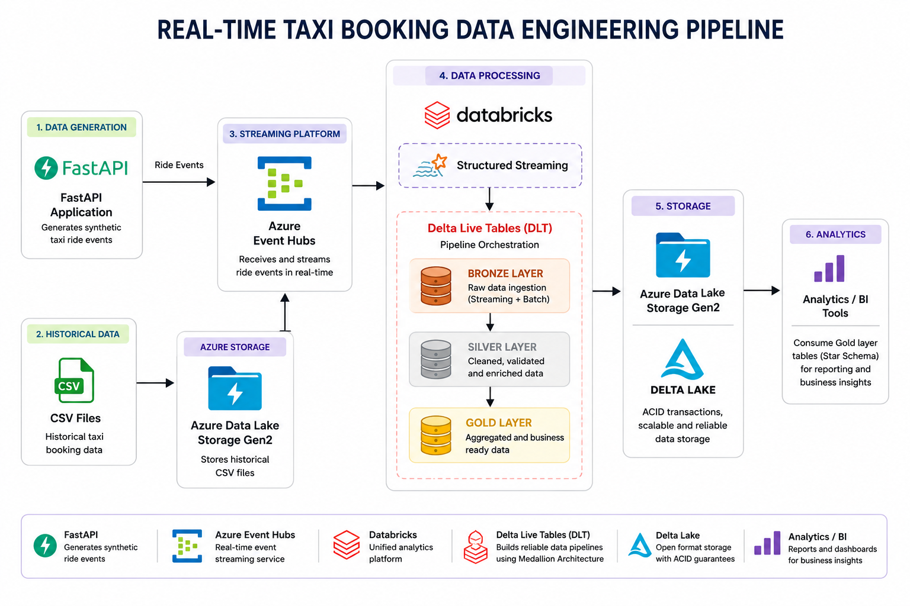

# Real-Time Taxi Booking Analytics Platform

## Overview

This project demonstrates an end-to-end **real-time Data Engineering pipeline** built on the Azure ecosystem using **Azure Databricks**, **Delta Live Tables (DLT)**, **Azure Event Hubs**, and **Delta Lake**.

The pipeline simulates taxi ride bookings through a FastAPI application, streams ride events into Azure Event Hubs, ingests the data into Databricks using Structured Streaming, and transforms it through the **Bronze → Silver → Gold** Medallion Architecture to create analytics-ready fact and dimension tables.

---

## Tech Stack

- **Cloud:** Microsoft Azure
- **Streaming:** Azure Event Hubs
- **Compute:** Azure Databricks
- **Pipeline:** Delta Live Tables (DLT)
- **Processing:** Apache Spark (PySpark)
- **Storage:** Azure Data Lake Storage Gen2
- **Data Format:** Delta Lake
- **Languages:** Python, SQL
- **API:** FastAPI

---

## Architecture



---

## Pipeline Overview

The pipeline processes both **historical** and **real-time** taxi booking data through a unified streaming architecture.

- **Data Generation** – A FastAPI application generates realistic taxi booking events using synthetic ride data.
- **Streaming Ingestion** – Ride events are published to Azure Event Hubs and consumed in Databricks using Structured Streaming.
- **Bronze Layer** – Stores raw streaming and historical ride data as Delta tables.
- **Silver Layer** – Parses, validates, enriches, and standardizes ride records.
- **Gold Layer** – Builds analytical fact and dimension tables using Delta Live Tables for downstream reporting and analytics.

---

## Key Features

- Real-time event streaming using Azure Event Hubs
- Batch and streaming data ingestion
- Delta Live Tables (DLT) pipeline orchestration
- Medallion Architecture (Bronze → Silver → Gold)
- Structured Streaming with Apache Spark
- Delta Lake for ACID-compliant storage
- Automated CDC processing for dimension tables
- Star schema data modeling
- Analytics-ready datasets

---

## Data Model

The Gold layer follows a **Star Schema** consisting of a central fact table surrounded by multiple dimension tables.

### Fact Table

- Fact Ride

### Dimension Tables

- Passenger
- Driver
- Vehicle
- Payment
- Booking
- Location
- Ride Status
- Cancellation Reason
- Vehicle Type
- Vehicle Make

---

## Project Structure

```text
.
├── ADF_pipelines/
│
├── Code_Files/
│   ├── ingest.py
│   ├── silver.py
│   ├── model.py
│   ├── bronze adls.ipynb
│   └── silver obt.ipynb
│
├── Data/
│
├── templates/
│
├── api.py
├── connection.py
├── data.py
├── architecture.png
└── README.md
```

---

## Skills Demonstrated

- Azure Databricks
- Delta Live Tables (DLT)
- Azure Event Hubs
- Apache Spark Structured Streaming
- PySpark
- Delta Lake
- ETL & ELT Pipeline Development
- Data Modeling
- Star Schema Design
- Change Data Capture (CDC)
- SQL
- Cloud Data Engineering

---

## License

This project is intended for learning and portfolio purposes.
